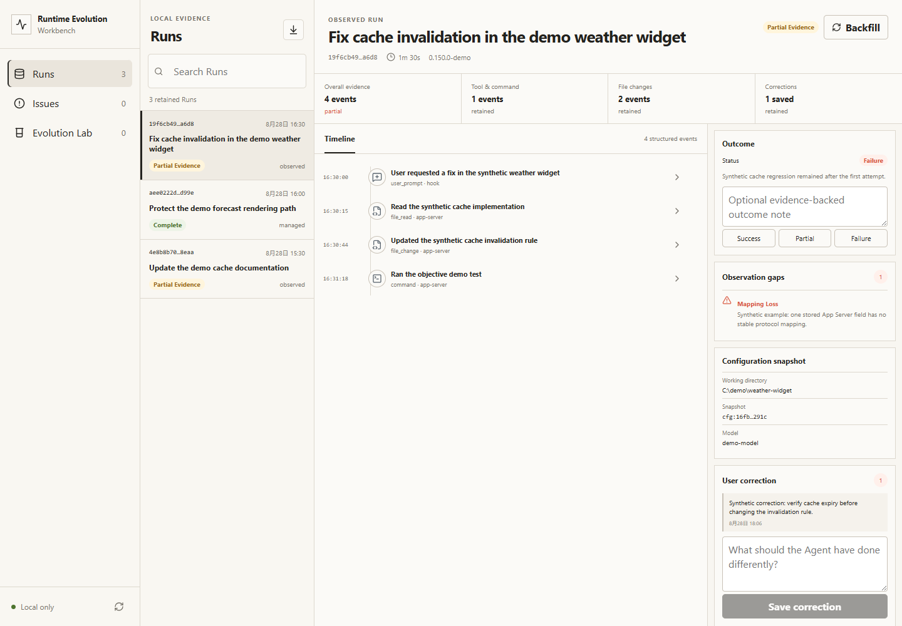

# Runtime Evolution Workbench

Runtime Evolution Workbench turns real Codex Runs into a local, reviewable improvement loop: keep what happened, identify what the evidence supports, test one bounded AGENTS.md or Skill change, and publish or roll it back safely.

It is not another trace dashboard. The product is useful when a Run is over:

1. retain the Run, result, correction, artifacts, and observation gaps;
2. connect a recurring problem to exact evidence and counterevidence;
3. compare the current and candidate capability file in isolated Git worktrees;
4. require objective verifier results and a human approval before publishing;
5. refuse to overwrite a file that changed after the proposal was created.

> **Release status:** 0.2 technical preview for Codex on Windows 11 x64, Linux x64, and Apple Silicon macOS. The tag workflow exercises each downloadable archive on GitHub-hosted runners. No physical Mac, ordinary user-owned clean machine, or authenticated Codex model run was used, so this release is not labeled stable.



## What you get

The local workbench has three product surfaces:

- **Runs** keeps observed and product-managed executions, structured events, artifacts, outcomes, user corrections, visible evidence gaps, and a read-only library for portable Run/Case/Score files.
- **Issues** turns selected evidence into a cause hypothesis. Instruction, Skill, tool, environment, permission, validation, model, and unknown remain separate categories.
- **Evolution Lab** shows the exact one-file diff, the original failure case, one protection case, four baseline/candidate results, and publish/rollback history.

The Codex plugin is the entry and capture layer. It contributes lifecycle Hooks, bounded MCP evidence tools, and a Skill. The standalone local service and React workbench are the product; the plugin does not contain a second database or execution engine.

## Evidence boundary

Runtime Evolution Workbench never claims to read hidden reasoning.

- An **Observed Run** is best-effort evidence from ordinary Codex use. A Hook can be delayed or missing. Stored App Server history is useful but lossy. The UI keeps those gaps visible.
- A **Managed Run** is launched through the workbench's own Codex App Server connection. Live Thread, Turn, Item, plan, command, tool, diff, usage, and terminal events can be retained; excluded data is recorded as an observation gap.
- A **comparison** runs the failure and protection cases once against baseline and once against candidate. It is explicitly labeled single-run evidence, not a general improvement claim.

Approval is enabled only when the four objective verifier cells support the candidate: failure-baseline fails, failure-candidate passes, and both protection cells pass. The workbench never auto-publishes.

The optional authenticated code-freeze gate does not accept a chat reply as proof. It creates a disposable repository and requires six real Codex App Server Runs to reproduce an objective failure and protection case, produce the four-cell verifier matrix, publish the approved `AGENTS.md` candidate, preserve a later user edit as a rollback conflict, and finally restore the exact original. Version 0.2.0 is published without that evidence and records the omission in its attested release manifests; the gate remains mandatory before any stable label.

## Quick start

Requirements:

- Windows 11 x64, Linux x64, or Apple Silicon macOS;
- Node.js 22.x, not Node 20 or 23;
- Git;
- a working Codex CLI/Desktop installation with `codex` on `PATH`;
- PowerShell 7 on Windows, or Bash on Linux/macOS.

Install and start the long-lived service from a normal host terminal: Windows Terminal or PowerShell on Windows, and Bash on Linux/macOS. Do not start it from a command that is already inside a Codex sandbox. Managed comparisons deliberately fail their no-model workspace preflight rather than falling back to unsandboxed execution.

On Windows, download `runtime-evolution-workbench-0.2.0.zip` and its `.sha256` file from the same GitHub Release. Verify the archive, extract it, inspect the installer, then run:

```powershell
$archive = '.\runtime-evolution-workbench-0.2.0.zip'
$expected = (Get-Content "$archive.sha256").Split()[0]
$actual = (Get-FileHash $archive -Algorithm SHA256).Hash.ToLowerInvariant()
if ($actual -ne $expected) { throw 'Runtime Evolution Workbench archive checksum mismatch.' }
Expand-Archive $archive -DestinationPath .
Set-Location runtime-evolution-workbench-0.2.0
.\scripts\Install.ps1 -Open
```

On Linux or Apple Silicon macOS, download `runtime-evolution-workbench-0.2.0-portable.tar.gz` and its `.sha256` file, then run:

```bash
archive=runtime-evolution-workbench-0.2.0-portable.tar.gz
node -e 'const fs=require("node:fs"),c=require("node:crypto");const p=process.argv[1],e=fs.readFileSync(p+".sha256","utf8").trim().split(/\s+/)[0],a=c.createHash("sha256").update(fs.readFileSync(p)).digest("hex");if(a!==e)process.exit(1)' "$archive"
tar -xzf "$archive"
cd runtime-evolution-workbench-0.2.0
chmod +x scripts/*.sh
./scripts/Install.sh --open
```

The release contains commit-bound manifests and GitHub build-provenance attestations. Windows startup is opt-in through `-EnableStartup`; the portable installer deliberately creates no systemd unit or LaunchAgent. Both installers register the extracted checkout as a Codex marketplace, install the plugin, and start the loopback-only service. Restart Codex after installation.

For source development or a portable Node build, clone the repository and set the executable explicitly:

```powershell
git clone https://github.com/rrrrrredy/runtime-evolution-workbench.git
Set-Location runtime-evolution-workbench
$env:REW_NODE = 'D:\path\to\node-v22\node.exe'
.\scripts\Check.ps1 -InstallDependencies
.\scripts\Start.ps1 -Open
```

See [installation and removal](docs/installation.md) for the exact state changes and offline behavior.

## Normal use

1. Use Codex normally. Hooks write redacted, atomic event envelopes to a local spool even when the workbench service is closed.
2. Open the local workbench with `.\scripts\Start.ps1 -Open` on Windows or `./scripts/Start.sh --open` on Linux/macOS, then label the result or save a correction.
3. Backfill a stored Codex Thread if needed. Treat the declared mapping gaps as part of the evidence.
4. Optionally open **Protocol library** on the Runs page and import an `agent.run.v1`, `workflow.case.v1`, or `workflow.score.v1` file. Imports are validated, redacted again, and kept read-only in this product's own database. An external Run does not enter Runs, Issues, or Evolution Lab as a native Codex experiment.
5. Create an Issue only when a Run or correction supports it. Keep counterevidence attached.
6. Create a proposal for exactly one `AGENTS.md` or one `SKILL.md`, using a failure Run and a distinct protection Run.
7. Supply objective verifier commands. The workbench creates detached Git worktrees and runs exactly four cells.
8. Review the exact diff and results. Approve and publish manually, or reject it.
9. Roll back from the workbench only while the target still matches the published candidate. Publication and rollback retain a same-volume recovery file and install only into an absent path; a concurrent save becomes a visible conflict instead of being replaced.
10. After closing editors and reconciling the named recovery file, delete its `.runtime-evolution-workbench-recovery-*` directory manually. The preview never deletes recovery files automatically.

Verifier commands execute locally in isolated worktrees with the current user's permissions. Review repository code and verifier arguments before running a comparison.

## Privacy and security

- The service refuses non-loopback hosts and binds only to `127.0.0.1`.
- A random local session token protects every API route; browser sessions use an HttpOnly, SameSite=Strict cookie.
- Hook input is redacted before spooling and again before durable storage. Secret-like fields, bearer tokens, API keys, GitHub tokens, private keys, and oversized content are handled explicitly.
- Structured events are retained; diagnostic content stays on the machine in a SHA-256 content store.
- Portable protocol imports are schema-validated before and after local redaction. Importing a Case or Score never grants it execution authority.
- The MCP server can collect evidence and create proposals. It intentionally has no approve or publish tool.
- Publishing verifies the original file hash. Rollback verifies the candidate hash and creates a conflict record when later edits exist.

Read [privacy and security](docs/privacy-and-security.md) before using the preview on sensitive repositories.

## Uninstall

```powershell
.\scripts\Uninstall.ps1
```

```bash
./scripts/Uninstall.sh
```

This stops the service and removes the Codex plugin, marketplace entry, and optional startup shortcut. It preserves Run data by default. To permanently remove the product data as an explicit separate choice:

```powershell
.\scripts\Uninstall.ps1 -DeleteData
```

```bash
./scripts/Uninstall.sh --delete-data
```

All entry points create only a nonexistent data directory or reuse one with this product's marker; existing unmarked directories are rejected. The uninstaller also rejects files/reparse points and broad protected locations, and never deletes the source checkout.
To obtain machine-readable proof that no service, PID file, Startup shortcut, plugin, or marketplace registration remains, run `.\scripts\Inspect-Installation.ps1 -RequireAbsent` on Windows or `./scripts/Inspect-Installation.sh --require-absent` on Linux/macOS. Add the platform's no-data flag only after an intentional data-deleting uninstall.

## Architecture

- Node 22, Fastify, built-in SQLite, and a content-addressed local store;
- React/Vite workbench served by the local service;
- separate Codex plugin with Hooks, raw-stdio MCP, and a Skill;
- version-probed Codex App Server adapter for stored-thread backfill and managed Runs;
- `@runcase/interchange` from an exact checksummed GitHub Release asset as the only cross-product dependency.

Runtime Evolution Workbench does not share its service, database, queue, UI, executor, or business code with Workflow Environment Factory. See [architecture](docs/architecture.md).
The exact portable-file boundary is documented in [protocol interoperability](docs/protocol.md).

## Deliberate non-goals for 0.2

No cloud sync, team permissions, model training, automatic publication, arbitrary capability-file editing, modification of Codex Hook/MCP configuration, other Agent products, or claims based on hidden reasoning. A generic trace viewer is not the product.

## Development

```powershell
$env:REW_NODE = 'C:\path\to\node-v22\node.exe'
.\scripts\Check.ps1 -InstallDependencies
```

The check performs strict server and web TypeScript builds, a production Vite build, all regression tests, and plugin/marketplace validation. Current acceptance steps and evidence rules are in [acceptance](docs/acceptance.md); the code-freeze and tag gates are documented in [release process](docs/release-process.md).

Contributions are welcome under [CONTRIBUTING.md](CONTRIBUTING.md). Security reports should follow [SECURITY.md](SECURITY.md).

## License

Apache-2.0. This permissive license includes an explicit patent grant, which is useful for an extensible Agent tool intended for individual and commercial adoption.
